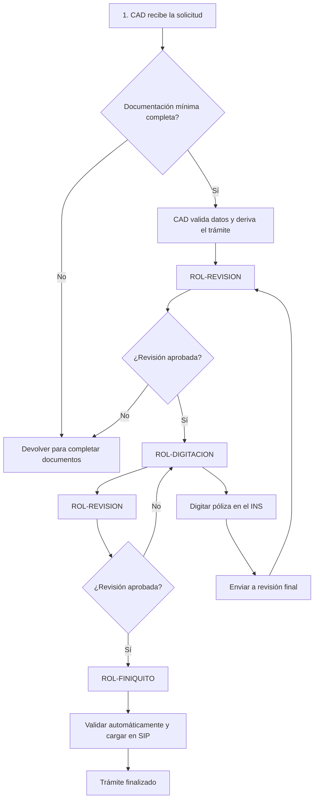

# Emisión de Hogar Comprensivo

## 1. Resumen

El trámite de **Emisión de Hogar Comprensivo** permite la emisión por ROL-DIGITACION.

El trámite ingresa como una **solicitud** al rol **CAD - Centro de Atención Digital**. CAD valida la documentación recibida, extrae datos relevantes y crea el trámite en el sistema.

## 2. ROL-CAD primer paso
El sistema muestra los documentos faltantes en caso de que no se hayan adjuntados los documentos requeridos. CAD puede devolver la solicitud al agente o solicitante para que complete la documentación.

Si los documentos minimos requeridos están presentes se hace una revisón de los datos extraídos y se valida la consistencia de la información. El sistema aplica reglas de derivación para determinar el próximo rol que debe intervenir.

- ➜ **ENVÍA** a ROL-REVISION en el resto de los casos.

## 3 Revisión ROL-REVISION
ROL-REVISION valida la información técnica, completa la cotización si no fue adjuntada.

- Si no existe DOC-COTIZACION-HOGAR, el revisor debe cotizar y subir el documento. El tramite se ➜ **ENVÍA** al sistema para ser procesado y derivado a ROL-REVISION cuando esté listo.

- Si la cotización existe, el revisor valida la información técnica y el interés asegurable.

- ➜ **ENVÍA** a ROL-DIGITACION para que se digite la póliza en los sistemas del INS o para realizar correcciones.
- ➜ **ENVÍA** a ROL-FINIQUITO si la póliza ya fue digitada.
- ↩ **DEVUELVE** a ROL-CAD si detecta inconsistencias, con comentarios para que el revisor haga las correcciones necesarias.
  - Los tramites devueltos a ROL-CAD quedan en **Pendientes** mientras CAD realiza su trabajo.

## 4. Digitación ROL-DIGITACION
Digita la póliza en los sistemas del INS, puede ingrear el **número de poliza**.

- ➜ **ENVÍA** a ROL-REVISION para validación final.
- ↩ **DEVUELVE** a ROL-REVISION si detecta inconsistencias, con comentarios para que el revisor haga las correcciones necesarias.

## 5. ROL-FINIQUITO

Lee la póliza vía webservice y la carga en SIP.

Se realizan validaciones automáticas.
En caso de no pasar las validaciones, ↩ **DEVUELVE** a ROL-REVISION para que se hagan las correcciones necesarias.

## 6. Diagrama del flujo 1 a 5 para usuarios

## 7. Documentos requeridos

| Orden | Documento | Código | Obligatorio | Responsable de validación | Observaciones |
|---:|---|---|---|---|---|
| 1 | Solicitud de hogar - parte 1 | DOC-SOLICITUD-HOGAR-P1 | Sí | CAD | Documento base del trámite |
| 2 | Solicitud de hogar - parte 2 | DOC-SOLICITUD-HOGAR-P2 | Sí | CAD | Documento base del trámite |
| 3 | Solicitud de hogar - parte 3 | DOC-SOLICITUD-HOGAR-P3 | Sí | CAD | Documento base del trámite |
| 4 | Solicitud de hogar - parte 4 | DOC-SOLICITUD-HOGAR-P4 | Sí | CAD | Documento base del trámite |
| 8 | Cotización | DOC-COTIZACION-HOGAR | Condicional | CAD / Revisión | Si no viene, puede cargarla revisión |
| 12 | Perfeccionamiento | DOC-PERFECCIONAMIENTO | Condicional | Revisión / Digitación | Se utiliza para el cierre del trámite |

## 8. Datos del trámite

---

# 5. Campos actuales del trámite

Los campos se documentan usando el **nombre actual del campo**, la **sección del formulario** y el **tipo de dato** informado en el archivo de campos.

## 5.1 Datos generales de la solicitud

| Sección | Campo actual | Label | Tipo de dato | Uso |
|---|---|---|---|---|
| FECHA DE SOLICITUD | `Fecha` | Fecha | Date | Fecha de ingreso o firma de solicitud |
| TIPO DE TRAMITE | `TIPOTRAMITE` | Tipo | List | Debe corresponder a Emisión |
| TIPO DE TRAMITE | `PolizaMadre` | Póliza Colectiva | Text | Aplica si pertenece a póliza colectiva |
| TIPO DE TRAMITE | `Poliza` | Poliza | Text | Número de póliza si corresponde |

## 5.3 Datos del asegurado

| Sección | Campo actual | Label | Tipo de dato | Uso |
|---|---|---|---|---|
| DATOS DEL ASEGURADO | `Asegurado.Nombre` | Nombre o Razón social | Text | Identificación del asegurado |
| DATOS DEL ASEGURADO | `Asegurado.TIpoIdentificacion` | Tipo de Identificación | List | Debe tomarse de catálogo del sistema |
| DATOS DEL ASEGURADO | `Asegurado.Identificacion` | Identificación | Text | Número de identificación |
| DATOS DEL ASEGURADO | `Asegurado.Email` | Correo Electrónico | Email | Medio de contacto |
| DATOS DEL ASEGURADO | `Asegurado.Domicilio` | Domicilio | Text | Dirección |
| DATOS DEL ASEGURADO | `Asegurado.Provincia` | Provincia | Text | Ubicación |
| DATOS DEL ASEGURADO | `Asegurado.Canton` | Cantón | Text | Ubicación |
| DATOS DEL ASEGURADO | `Asegurado.Distrito` | Distrito | Text | Ubicación |
| DATOS DEL ASEGURADO | `Asegurado.Telefono` | Teléfono | Phone | Teléfono principal |
| DATOS DEL ASEGURADO | `Asegurado.Telefono2` | Teléfono2 | Phone | Teléfono secundario |
| DATOS DEL ASEGURADO | `Asegurado.Notificacion` | Notificar | List | Tomador o asegurado |
| DATOS DEL ASEGURADO | `Asegurado.MedioNotificacion` | Notificar vía | List | Domicilio, teléfono, correo, apartado postal o fax |

## 5.9 Prima y observaciones

| Sección | Campo actual | Label | Tipo de dato | Uso |
|---|---|---|---|---|
| PRIMA DEL SEGURO | `Prima.Subtotal` | Subtotal | Number | Prima antes de ajustes |
| PRIMA DEL SEGURO | `Prima.FactorExperiencia` | Experiencia Siniestral | Number | Factor de experiencia |
| PRIMA DEL SEGURO | `Prima.IVA` | Impuestos IVA | Number | Impuestos |
| PRIMA DEL SEGURO | `Prima` | Prima Total | Number | Prima total |
| OBSERVACIONES | `Observaciones` | Observaciones | Text | Comentarios generales |

## 11. Pasos operativos por rol

### 11.1 CAD

#### Entrada

- Solicitud inicial.
- Documentos adjuntos.
- Datos capturados o extraídos automáticamente.

#### Tareas

1. Ordenar documentos.
2. Validar documentos requeridos.
3. Extraer datos de persona.
4. Extraer datos del vehículo.
5. Validar consistencia de placa.
6. Consultar o imprimir información del Registro Nacional.
7. Crear trámite.
8. Derivar según reglas.

#### Salidas posibles

| Resultado | Próximo rol |
|---|---|
| Documentación incompleta | Agente / solicitante |
| Documentación completa y requiere revisión | Revisión |
| Requiere tratamiento especial | Trámites |
| Puede digitarse | Digitación |
| Puede finalizarse | Finiquito |

### 11.2 Revisión

#### Entrada

- Trámite creado por CAD.
- Documentos validados.
- Datos extraídos.
- Alertas de reglas.

#### Tareas

1. Completar cotización si no fue adjuntada.
2. Validar información técnica.
3. Validar interés asegurable.
4. Informar prima deseada.
5. Completar emisión desde / hasta.
6. Completar tipo y código de contrato.
7. Enviar a digitación.

#### Salidas posibles

| Resultado | Próximo rol |
|---|---|
| Falta documentación | Agente / CAD |
| Requiere sede o trámite especial | Trámites |
| Aprobado para digitar | Digitación |

### 11.3 Digitación

#### Entrada

- Datos ordenados del sistema.
- Indicaciones del revisor.
- Alertas aplicables.

#### Tareas

1. Tomar datos desde el sistema.
2. Cargar datos en sistemas del INS.
3. Digitar la póliza.
4. Registrar resultado.
5. Enviar a revisión final.

#### Salidas posibles

| Resultado | Próximo rol |
|---|---|
| Póliza digitada | Revisión |
| Error detectado | Digitación |
| Requiere aclaración | Revisión |

### 11.4 Revisión final

#### Entrada

- Póliza digitada.
- Datos del sistema.
- Condiciones de póliza.

#### Tareas

1. Validar que la digitación sea correcta.
2. Verificar póliza en sistemas del INS.
3. Comparar datos emitidos contra datos del sistema.
4. Registrar condiciones.
5. Enviar a finiquito si corresponde.

#### Salidas posibles

| Resultado | Próximo rol |
|---|---|
| Digitación incorrecta | Digitación |
| Datos no coinciden | Revisión |
| Datos correctos | Finiquito |

### 11.5 Finiquito

#### Entrada

- Póliza verificada.
- Datos coincidentes.
- Condiciones registradas.

#### Tareas

1. Generar finiquito.
2. Cerrar trámite.
3. Dejar trazabilidad del cierre.

## 12. Alertas del sistema

| Código | Mensaje | Condición | Rol visible |
|---|---|---|---|
| ALERT-VIGENCIA-CORTO-PLAZO | La vigencia es de corto plazo. Revisar envío a sede. | Vigencia = Corto Plazo | CAD / Revisión |
| ALERT-VEHICULO-MODIFICADO | Vehículo modificado o hecho a medida. Requiere revisión especial. | Vehículo modificado = Sí | CAD / Revisión |
| ALERT-EXONERADO | Vehículo exonerado. Validar forma de aseguramiento. | Exonerado = Sí | Digitación |
| ALERT-EXTRA-PRIMA | Aplica extra prima en repuestos. Validar digitación. | Extra prima = Sí | Digitación |
| ALERT-ACREEDOR | El trámite posee acreedor. Completar datos correspondientes. | Acreedor = Sí | Digitación |
| ALERT-BENEFICIARIO | El trámite posee beneficiario. Completar datos correspondientes. | Beneficiario = Sí | Digitación |

## 13. Observaciones funcionales

- El sistema debe permitir devolución al agente cuando falten requisitos.
- El sistema debe permitir devolución a CAD cuando el trámite no pueda realizarse desde digitación.
- Las devoluciones deberían manejarse con un modelo híbrido:
  - motivo tipificado;
  - observación libre;
  - documentos o datos requeridos.
- Las reglas deben quedar registradas con código estable.
- Las alertas deben ser visibles por rol y por etapa.
- El sistema debería guardar trazabilidad de:
  - usuario;
  - rol;
  - fecha;
  - acción;
  - regla aplicada;
  - destino del trámite.

## 14. Historial de cambios

| Versión | Fecha | Autor | Cambio |
|---|---|---|---|
| 1.0 | 2026-07-10 | Equipo funcional | Primera versión estandarizada |