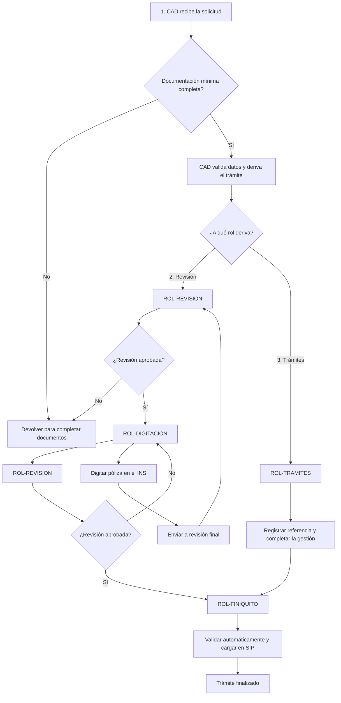

# Emisión de Automóvil

## 1. Resumen

El trámite de **Emisión de Automóvil** permite la emisión por ROL-DIGITACION o ROL-TRAMITES.

El trámite ingresa como una **solicitud** al rol **CAD - Centro de Atención Digital**. CAD valida la documentación recibida, extrae datos relevantes y crea el trámite en el sistema.

## 2. ROL-CAD primer paso
El sistema muestra los documentos faltantes en caso de que no se hayan adjuntados los documentos requeridos. CAD puede devolver la solicitud al agente o solicitante para que complete la documentación.

Si los documentos minimos requeridos están presentes se hace una revisón de los datos extraídos y se valida la consistencia de la información. El sistema aplica reglas de derivación para determinar el próximo rol que debe intervenir.

### Reglas de derivación posibles:
- Vigencia.Periodo = Corto Plazo → ROL-TRAMITES
- Riesgo.Modificado = Sí → ROL-TRAMITES
- TramiteEnSede = Sí → ROL-TRAMITES

En el resto de los casos, el trámite puede enviarse a ROL-REVISION.

## 3.a Revisión ROL-REVISION
ROL-REVISION valida la información técnica, completa la cotización si no fue adjuntada.

- Si no existe DOC-COTIZACION-AUT, el revisor debe cotizar y subir el documento. El tramite se envia al sistema para ser procesado y derivado a ROL-REVISION cuando esté listo.

- Si la cotización existe, el revisor valida la información técnica y el interés asegurable. Si todo es correcto, ➜ **ENVÍA** a ROL-DIGITACION.

- ➜ **ENVÍA** a ROL-DIGITACION para que se digite la póliza en los sistemas del INS o para realizar correcciones.
- ➜ **ENVÍA** a ROL-FINIQUITO si la póliza ya fue digitada.
- ↩ **DEVUELVE** a ROL-CAD si detecta inconsistencias, con comentarios para que el revisor haga las correcciones necesarias.
  - Los tramites devueltos a ROL-CAD quedan en **Pendientes** mientras CAD realiza su trabajo.

## 3.b Sede ROL-TRAMITES
ROL-TRAMITES actua como un revisor, puede cargar la cotización si no existe, pero no es obligatoria.

- Se debe ingresar el valor **Referencia** para hacer seguimiento del tramite.
- Los tramites en ROL-TRAMITES quedan en **Pendientes** mientras la SEDE realiza su trabajo.
- ➜ **ENVÍA** a ROL-FINIQUITO una vez emitida la póliza e ingresado el número de póliza.

## 4. Digitación ROL-DIGITACION
Digita la póliza en los sistemas del INS, puede ingrear el **número de poliza**.

- ➜ **ENVÍA** a ROL-REVISION para validación final.
- ↩ **DEVUELVE** a ROL-REVISION si detecta inconsistencias, con comentarios para que el revisor haga las correcciones necesarias.

## 5. ROL-FINIQUITO

Lee la póliza vía webservice y la carga en SIP.

Se realizan validaciones automáticas.
En caso de no pasar las validaciones, ↩ **DEVUELVE** a ROL-REVISION para que se hagan las correcciones necesarias.

## 6. Diagrama del flujo 1 a 5 para usuarios

## 7. Documentos requeridos

| Orden | Documento | Código | Obligatorio | Responsable de validación | Observaciones |
|---:|---|---|---|---|---|
| 1 | Solicitud de automóvil - parte 1 | DOC-SOLICITUD-AUT-P1 | Sí | CAD | Documento base del trámite |
| 2 | Solicitud de automóvil - parte 2 | DOC-SOLICITUD-AUT-P2 | Sí | CAD | Continuación de la solicitud |
| 3 | Solicitud de automóvil - parte 3 | DOC-SOLICITUD-AUT-P3 | Sí | CAD | Continuación de la solicitud |
| 4 | Solicitud de automóvil - parte 4 | DOC-SOLICITUD-AUT-P4 | Sí | CAD | Continuación de la solicitud |
| 5 | KYC | DOC-KYC | Sí | CAD | Validar existencia |
| 6 | Guía de inspección | DOC-GUIA-INSPECCION | Sí | CAD / Revisión | Debe coincidir con la placa |
| 7 | Boleta de cargo automático o PDM | DOC-CARGO-AUTOMATICO-PDM | Condicional | CAD | Aplica según forma de pago |
| 8 | Cotización | DOC-COTIZACION-AUT | Condicional | CAD / Revisión | Si no viene, puede cargarla revisión |
| 9 | Fotos | DOC-FOTOS | Condicional | CAD | Según solicitud o comprobante |
| 10 | Revisión técnica | DOC-REVISION-TECNICA | Condicional | CAD | Puede venir física o indicada en guía |
| 11 | Deber de información | DOC-DEBER-INFORMACION | Sí | CAD | Validar existencia |
| 12 | Perfeccionamiento | DOC-PERFECCIONAMIENTO | Condicional | Revisión / Digitación | Se utiliza para el cierre del trámite |
| 13 | Comprobante de entrega | DOC-COMPROBANTE-ENTREGA | Sí | CAD | Validar existencia |

## 8. Datos del trámite

Los campos se documentan usando el **nombre actual del campo**, la **sección del formulario** y el **tipo de dato** informado en el archivo de campos.

## 8.1 Datos generales de la solicitud

| Sección | Campo actual | Label | Tipo de dato | Uso |
|---|---|---|---|---|
| FECHA DE SOLICITUD | `Fecha` | Fecha | Date | Fecha de ingreso o firma de solicitud |
| TIPO DE TRAMITE | `TIPOTRAMITE` | Tipo | List | Debe corresponder a Emisión |
| TIPO DE TRAMITE | `PolizaMadre` | Póliza Colectiva | Text | Aplica si pertenece a póliza colectiva |
| TIPO DE TRAMITE | `Poliza` | Poliza | Text | Número de póliza si corresponde |

## 8.2 Datos del tomador

| Sección | Campo actual | Label | Tipo de dato | Uso |
|---|---|---|---|---|
| DATOS DEL TOMADOR | `Tomador.Nombre` | Nombre o Razón social | Text | Identificación del tomador |
| DATOS DEL TOMADOR | `Tomador.TIpoIdentificacion` | Tipo de Identificación | List | Debe tomarse de catálogo del sistema |
| DATOS DEL TOMADOR | `Tomador.Identificacion` | Identificación | Text | Número de identificación |
| DATOS DEL TOMADOR | `Tomador.Email` | Correo Electrónico | Email | Medio de contacto |
| DATOS DEL TOMADOR | `Tomador.Domicilio` | Domicilio | Text | Dirección del tomador |
| DATOS DEL TOMADOR | `Tomador.Provincia` | Provincia | Text | Ubicación |
| DATOS DEL TOMADOR | `Tomador.Canton` | Cantón | Text | Ubicación |
| DATOS DEL TOMADOR | `Tomador.Distrito` | Distrito | Text | Ubicación |
| DATOS DEL TOMADOR | `Tomador.Telefono` | Teléfono | Phone | Teléfono principal |
| DATOS DEL TOMADOR | `Tomador.Telefono2` | Teléfono2 | Phone | Teléfono secundario |

## 8.3 Datos del asegurado

| Sección | Campo actual | Label | Tipo de dato | Uso |
|---|---|---|---|---|
| DATOS DEL ASEGURADO | `Asegurado.Nombre` | Nombre o Razón social | Text | Identificación del asegurado |
| DATOS DEL ASEGURADO | `Asegurado.TIpoIdentificacion` | Tipo de Identificación | List | Debe tomarse de catálogo del sistema |
| DATOS DEL ASEGURADO | `Asegurado.Identificacion` | Identificación | Text | Número de identificación |
| DATOS DEL ASEGURADO | `Asegurado.Email` | Correo Electrónico | Email | Medio de contacto |
| DATOS DEL ASEGURADO | `Asegurado.Domicilio` | Domicilio | Text | Dirección |
| DATOS DEL ASEGURADO | `Asegurado.Provincia` | Provincia | Text | Ubicación |
| DATOS DEL ASEGURADO | `Asegurado.Canton` | Cantón | Text | Ubicación |
| DATOS DEL ASEGURADO | `Asegurado.Distrito` | Distrito | Text | Ubicación |
| DATOS DEL ASEGURADO | `Asegurado.Telefono` | Teléfono | Phone | Teléfono principal |
| DATOS DEL ASEGURADO | `Asegurado.Telefono2` | Teléfono2 | Phone | Teléfono secundario |
| DATOS DEL ASEGURADO | `Asegurado.Notificacion` | Notificar | List | Tomador o asegurado |
| DATOS DEL ASEGURADO | `Asegurado.MedioNotificacion` | Notificar vía | List | Domicilio, teléfono, correo, apartado postal o fax |

## 8.4 Datos del riesgo / vehículo

| Sección | Campo actual | Label | Tipo de dato | Uso |
|---|---|---|---|---|
| DATOS DEL RIESGO | `Riesgo.Placa` | Placa | Text | Dato crítico para validaciones |
| DATOS DEL RIESGO | `Riesgo.Marca` | Marca, Modelo, Serie | Text | Identificación del vehículo |
| DATOS DEL RIESGO | `Riesgo.Combustible` | Combustible | Text | Dato técnico |
| DATOS DEL RIESGO | `Riesgo.Año` | Año | Number | Año del vehículo |
| DATOS DEL RIESGO | `Riesgo.Color` | Color | Text | Dato técnico |
| DATOS DEL RIESGO | `Riesgo.PesoBruto` | Peso Bruto | Number | Dato técnico |
| DATOS DEL RIESGO | `Riesgo.Cilindraje` | Cilindraje | Number | Dato técnico |
| DATOS DEL RIESGO | `Riesgo.Capacidad` | Capacidad | Number | Capacidad del vehículo |
| DATOS DEL RIESGO | `Riesgo.Tipo` | Tipo Vehículo | Text | Tipo de vehículo |
| DATOS DEL RIESGO | `Riesgo.VIN` | Chasis/VIN | Text | Identificador del vehículo |
| DATOS DEL RIESGO | `Riesgo.NroMotor` | Nro Motor | Text | Número de motor |
| DATOS DEL RIESGO | `Riesgo.Uso` | Uso | List | Personal, comercial, internacional u otro |
| DATOS DEL RIESGO | `Riesgo.MonedaValor` | Moneda | List | Colones o dólares |
| DATOS DEL RIESGO | `Riesgo.Valor` | Valor | Number | Valor declarado |
| DATOS DEL RIESGO | `Riesgo.ActualizacionAutomatica` | Actualizacion monto | List | Sí / No |
| DATOS DEL RIESGO | `Riesgo.Modificado` | A medida/Modificado | List | Campo usado para derivación |
| DATOS DEL RIESGO | `Riesgo.Exonerado` | Exonerado imp. | List | Campo usado para alerta |
| DATOS DEL RIESGO | `Riesgo.ExtraPrima` | Extraprima | List | Campo usado para alerta |

## 8.5 Aspectos relacionados al riesgo

| Sección | Campo actual | Label | Tipo de dato | Uso |
|---|---|---|---|---|
| ASPECTOS RELACIONADOS AL RIESGO | `Riesgo.InteresAsegurable` | Interés asegurable | List | Dato que debe validar revisión |
| ASPECTOS RELACIONADOS AL RIESGO | `Acreedor.Nombre` | Acreedor | Text | Aplica si existe acreedor |
| ASPECTOS RELACIONADOS AL RIESGO | `Acreedor.Identificacion` | Id Acreedor | Text | Identificación del acreedor |
| ASPECTOS RELACIONADOS AL RIESGO | `Acreedor.TipoIdentificacion` | Tipo de Identificación Acreedor | List | Catálogo del sistema |
| ASPECTOS RELACIONADOS AL RIESGO | `Acreedor.Monto` | Acreedor Monto | Number | Monto acreedor |
| ASPECTOS RELACIONADOS AL RIESGO | `Acreedor.Porcentaje` | Porcentaje Acreencia | Number | Porcentaje de acreencia |
| ASPECTOS RELACIONADOS AL RIESGO | `Conductor.Nombre` | Conductor Habitual | Text | Aplica si se informa conductor |
| ASPECTOS RELACIONADOS AL RIESGO | `Conductor.Identificacion` | Id Conductor | Text | Identificación del conductor |

## 8.6 Forma de aseguramiento, deducibles y vigencia

| Sección | Campo actual | Label | Tipo de dato | Uso |
|---|---|---|---|---|
| FORMAS DE ASEGURAMIENTO | `FormaAseguramiento` | Forma de Aseguramiento | List | Valor Declarado, Primer riesgo absoluto o Valor convenido |
| DETALLE DE DEDUCIBLES | `Deducible.C.Tipo` | Deducible C | List | Tipo de deducible |
| DETALLE DE DEDUCIBLES | `Deducible.C.Minimo` | Deducible C Mínimo | Number | Monto mínimo |
| DETALLE DE DEDUCIBLES | `Deducible.DFH.Tipo` | Deducible D F H | List | Tipo de deducible |
| DETALLE DE DEDUCIBLES | `Deducible.DFH.Minimo` | Deducible D F H Mínimo | Number | Monto mínimo |
| PLAZO DE VIGENCIA | `Vigencia.Desde` | Vigencia Desde | Date | Fecha desde |
| PLAZO DE VIGENCIA | `Vigencia.Hasta` | Vigencia Hasta | Date | Fecha hasta |
| PLAZO DE VIGENCIA | `Vigencia.Periodo` | Vigencia | List | Anual o Corto Plazo |

## 8.7 Forma de pago y conducto de cobro

| Sección | Campo actual | Label | Tipo de dato | Uso |
|---|---|---|---|---|
| ELECCION DE OPCIONES | `FormaDePago` | Forma de pago | List | Debe tomarse del sistema |
| ELECCION DE OPCIONES | `ConductoDeCobro` | Conducto de cobro | List | Cargo Automático o Deducción Mensual |

## 8.8 Coberturas

| Sección | Campo actual | Label | Tipo de dato | Uso |
|---|---|---|---|---|
| DETALLE DE COBERTURAS | `Cobertura.A` | A por accidente | Number | Monto de cobertura |
| DETALLE DE COBERTURAS | `Cobertura.Apersona` | A por persona | Number | Monto de cobertura |
| DETALLE DE COBERTURAS | `Cobertura.B` | B | Number | Monto de cobertura |
| DETALLE DE COBERTURAS | `Cobertura.C` | C | Number | Monto de cobertura |
| DETALLE DE COBERTURAS | `Cobertura.D` | D | Number | Monto de cobertura |
| DETALLE DE COBERTURAS | `Cobertura.F` | F | Number | Monto de cobertura |
| DETALLE DE COBERTURAS | `Cobertura.G` | G | Number | Monto de cobertura |
| DETALLE DE COBERTURAS | `Cobertura.H` | H | Number | Monto de cobertura |
| DETALLE DE COBERTURAS | `Cobertura.J` | J | Number | Monto de cobertura |
| DETALLE DE COBERTURAS | `Cobertura.K` | K | Number | Monto de cobertura |
| DETALLE DE COBERTURAS | `Cobertura.M` | M | Number | Monto de cobertura |
| DETALLE DE COBERTURAS | `Cobertura.N` | N | Number | Monto de cobertura |
| DETALLE DE COBERTURAS | `Cobertura.P` | P | Number | Monto de cobertura |
| DETALLE DE COBERTURAS | `Cobertura.Y` | Y | Number | Monto de cobertura |
| DETALLE DE COBERTURAS | `Cobertura.Z` | Z | Number | Monto de cobertura |
| DETALLE DE COBERTURAS | `Cobertura.IDD` | IDD | Number | Monto de cobertura |
| DETALLE DE COBERTURAS | `Cobertura.IDP` | IDP | Number | Monto de cobertura |
| DETALLE DE COBERTURAS | `Cobertura.Alcohol` | Alcohol | Number | Monto de cobertura |
| DETALLE DE COBERTURAS | `Cobertura.Blindaje` | Blindaje | Number | Monto de cobertura |
| DETALLE DE COBERTURAS | `Cobertura.Acople` | Acople | Number | Monto de cobertura |
| DETALLE DE COBERTURAS | `Cobertura.EquipoEspecial` | Equipo Especial | Number | Monto de cobertura |
| DETALLE DE COBERTURAS | `Cobertura.ActuacionesFlotilla` | Actuaciones Flotilla | Number | Monto de cobertura |

## 8.9 Prima y observaciones

| Sección | Campo actual | Label | Tipo de dato | Uso |
|---|---|---|---|---|
| PRIMA DEL SEGURO | `Prima.Subtotal` | Subtotal | Number | Prima antes de ajustes |
| PRIMA DEL SEGURO | `Prima.FactorExperiencia` | Experiencia Siniestral | Number | Factor de experiencia |
| PRIMA DEL SEGURO | `Prima.IVA` | Impuestos IVA | Number | Impuestos |
| PRIMA DEL SEGURO | `Prima` | Prima Total | Number | Prima total |
| OBSERVACIONES | `Observaciones` | Observaciones | Text | Comentarios generales |
| OBSERVACIONES | `Fotografias` | Fotografias | List | Sí, No, No se requieren |
| OBSERVACIONES | `Fotografias.ConsecutivoWeb` | Consecutivo web | Text | Consecutivo de fotos cargadas |

## 9. Validaciones

### 9.1 Validaciones documentales

| Código | Validación | Rol | Resultado si falla |
|---|---|---|---|
| VAL-DOC-001 | Debe existir solicitud | CAD | No permite crear trámite |
| VAL-DOC-002 | Debe existir guía de inspección | CAD | Solicitar documento faltante |
| VAL-DOC-003 | Debe existir deber de información | CAD | Solicitar documento faltante |
| VAL-DOC-004 | Debe existir comprobante de entrega | CAD | Solicitar documento faltante |
| VAL-DOC-005 | Si la forma de pago es cargo automático o PDM, debe existir documento asociado | CAD | Solicitar documento faltante |

### 9.2 Validaciones de consistencia

| Código | Validación | Datos comparados | Rol | Resultado si falla |
|---|---|---|---|---|
| VAL-CONS-001 | La placa debe coincidir entre solicitud, guía de inspección, cotización y revisión técnica | DATA-VEHICULO-PLACA | CAD | Alerta y revisión manual |
| VAL-CONS-002 | La identificación del propietario debe coincidir con la solicitud cuando corresponda | DATA-PERSONA-ID | CAD / Revisión | Alerta y revisión manual |
| VAL-CONS-003 | Los datos de póliza emitida deben coincidir con los datos del sistema | Datos de póliza | Revisión final | Devolver a revisión o digitación |

## 10. Reglas de derivación

| Código | Condición | Acción | Rol destino | Prioridad |
|---|---|---|---|---:|
| RULE-VIGENCIA-CORTO-PLAZO | Vigencia = Corto Plazo | Generar alerta y enviar a sede / trámites especiales | Trámites | 100 |
| RULE-VEHICULO-MODIFICADO | Vehículo hecho a medida o modificado = Sí | Generar alerta y enviar a sede / revisión especial | Trámites | 90 |
| RULE-EXONERADO | Vehículo exonerado de impuestos = Sí | Alertar para digitar con forma de aseguramiento correcta | Digitación | 80 |
| RULE-EXTRA-PRIMA-REPUESTOS | Paga extra prima en repuestos = Sí | Alertar para digitar con forma de aseguramiento correcta | Digitación | 80 |
| RULE-SIN-COTIZACION | No existe cotización | Revisor debe cotizar antes de continuar | Revisión | 70 |
| RULE-ACREEDOR | Cuenta con acreedor = Sí | Alertar para digitar información de acreedor | Digitación | 60 |
| RULE-BENEFICIARIO | Cuenta con beneficiario = Sí | Alertar para digitar información de beneficiario | Digitación | 60 |
| RULE-CONDUCTOR-HABITUAL | Cuenta con conductor habitual = Sí | Alertar para digitar información correspondiente | Digitación | 60 |

## 11. Pasos operativos por rol

### 11.1 CAD

#### Entrada

- Solicitud inicial.
- Documentos adjuntos.
- Datos capturados o extraídos automáticamente.

#### Tareas

1. Ordenar documentos.
2. Validar documentos requeridos.
3. Extraer datos de persona.
4. Extraer datos del vehículo.
5. Validar consistencia de placa.
6. Consultar o imprimir información del Registro Nacional.
7. Crear trámite.
8. Derivar según reglas.

#### Salidas posibles

| Resultado | Próximo rol |
|---|---|
| Documentación incompleta | Agente / solicitante |
| Documentación completa y requiere revisión | Revisión |
| Requiere tratamiento especial | Trámites |
| Puede digitarse | Digitación |
| Puede finalizarse | Finiquito |

### 11.2 Revisión

#### Entrada

- Trámite creado por CAD.
- Documentos validados.
- Datos extraídos.
- Alertas de reglas.

#### Tareas

1. Completar cotización si no fue adjuntada.
2. Validar información técnica.
3. Validar interés asegurable.
4. Informar prima deseada.
5. Completar emisión desde / hasta.
6. Completar tipo y código de contrato.
7. Enviar a digitación.

#### Salidas posibles

| Resultado | Próximo rol |
|---|---|
| Falta documentación | Agente / CAD |
| Requiere sede o trámite especial | Trámites |
| Aprobado para digitar | Digitación |

### 11.3 Digitación

#### Entrada

- Datos ordenados del sistema.
- Indicaciones del revisor.
- Alertas aplicables.

#### Tareas

1. Tomar datos desde el sistema.
2. Cargar datos en sistemas del INS.
3. Digitar la póliza.
4. Registrar resultado.
5. Enviar a revisión final.

#### Salidas posibles

| Resultado | Próximo rol |
|---|---|
| Póliza digitada | Revisión |
| Error detectado | Digitación |
| Requiere aclaración | Revisión |

### 11.4 Revisión final

#### Entrada

- Póliza digitada.
- Datos del sistema.
- Condiciones de póliza.

#### Tareas

1. Validar que la digitación sea correcta.
2. Verificar póliza en sistemas del INS.
3. Comparar datos emitidos contra datos del sistema.
4. Registrar condiciones.
5. Enviar a finiquito si corresponde.

#### Salidas posibles

| Resultado | Próximo rol |
|---|---|
| Digitación incorrecta | Digitación |
| Datos no coinciden | Revisión |
| Datos correctos | Finiquito |

### 11.5 Finiquito

#### Entrada

- Póliza verificada.
- Datos coincidentes.
- Condiciones registradas.

#### Tareas

1. Generar finiquito.
2. Cerrar trámite.
3. Dejar trazabilidad del cierre.

## 12. Alertas del sistema

| Código | Mensaje | Condición | Rol visible |
|---|---|---|---|
| ALERT-VIGENCIA-CORTO-PLAZO | La vigencia es de corto plazo. Revisar envío a sede. | Vigencia = Corto Plazo | CAD / Revisión |
| ALERT-VEHICULO-MODIFICADO | Vehículo modificado o hecho a medida. Requiere revisión especial. | Vehículo modificado = Sí | CAD / Revisión |
| ALERT-EXONERADO | Vehículo exonerado. Validar forma de aseguramiento. | Exonerado = Sí | Digitación |
| ALERT-EXTRA-PRIMA | Aplica extra prima en repuestos. Validar digitación. | Extra prima = Sí | Digitación |
| ALERT-ACREEDOR | El trámite posee acreedor. Completar datos correspondientes. | Acreedor = Sí | Digitación |
| ALERT-BENEFICIARIO | El trámite posee beneficiario. Completar datos correspondientes. | Beneficiario = Sí | Digitación |

## 13. Observaciones funcionales

- El sistema debe permitir devolución al agente cuando falten requisitos.
- El sistema debe permitir devolución a CAD cuando el trámite no pueda realizarse desde digitación.
- Las devoluciones deberían manejarse con un modelo híbrido:
  - motivo tipificado;
  - observación libre;
  - documentos o datos requeridos.
- Las reglas deben quedar registradas con código estable.
- Las alertas deben ser visibles por rol y por etapa.
- El sistema debería guardar trazabilidad de:
  - usuario;
  - rol;
  - fecha;
  - acción;
  - regla aplicada;
  - destino del trámite.

## 14. Historial de cambios

| Versión | Fecha | Autor | Cambio |
|---|---|---|---|
| 1.0 | 2026-07-10 | Equipo funcional | Primera versión estandarizada |