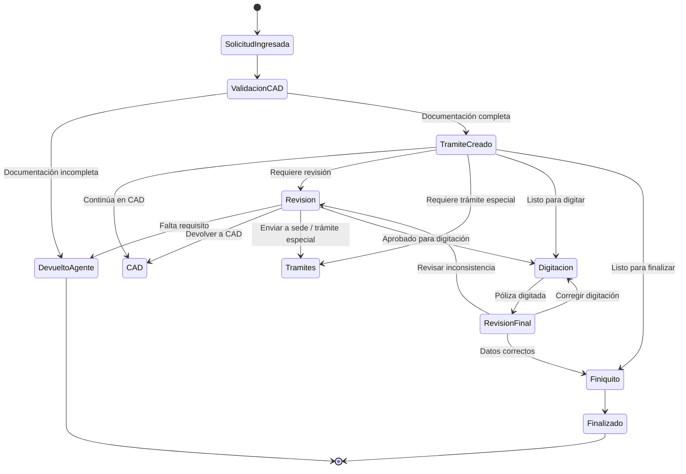

# Workflow CAD → Revisión → Digitación → Finiquito

## 1. Resumen

Este workflow describe el circuito general para trámites que ingresan como solicitud al rol **CAD**, son validados documentalmente, pasan por revisión funcional, digitación operativa y cierre mediante finiquito.

## 2. Diagrama general

## 3. Estados

| Estado | Código | Descripción | Rol responsable |
|---|---|---|---|
| Solicitud ingresada | ST-SOLICITUD-INGRESADA | Solicitud recibida pendiente de validación | CAD |
| Validación CAD | ST-VALIDACION-CAD | CAD valida documentos y datos iniciales | CAD |
| Trámite creado | ST-TRAMITE-CREADO | El trámite ya fue creado en el sistema | CAD |
| Revisión | ST-REVISION | Revisor valida requisitos y datos técnicos | Revisión |
| Trámites | ST-TRAMITES | Tratamiento especial o derivación a sede | Trámites |
| Digitación | ST-DIGITACION | Digitador carga póliza en sistemas correspondientes | Digitación |
| Revisión final | ST-REVISION-FINAL | Revisor valida la póliza digitada | Revisión |
| Finiquito | ST-FINIQUITO | Se genera cierre del trámite | Finiquito |
| Finalizado | ST-FINALIZADO | Trámite cerrado | Sistema |
| Devuelto al agente | ST-DEVUELTO-AGENTE | Se devuelve por falta de requisitos o corrección | CAD / Revisión |

## 4. Transiciones

| Desde | Hacia | Código | Condición | Acción |
|---|---|---|---|---|
| Solicitud ingresada | Validación CAD | TR-INICIAR-CAD | Solicitud recibida | Asignar a CAD |
| Validación CAD | Devuelto al agente | TR-DEVOLVER-AGENTE | Documentación incompleta | Registrar motivo |
| Validación CAD | Trámite creado | TR-CREAR-TRAMITE | Documentación válida | Crear trámite |
| Trámite creado | Revisión | TR-ENVIAR-REVISION | Requiere revisión | Asignar revisor |
| Trámite creado | Trámites | TR-ENVIAR-TRAMITES | Requiere tratami*nto especial | Asignar área |
| Re*isión | Digitación | TR-ENVIAR-DIG*TACION | Revisión aprobada | Asign*r digitador |
| Digitación | Revis*ón final | TR-ENVIAR-REVISION-FINA* | Póliza digitada | Asignar revis*r |
| Revisión final | Digitación * TR-CORREGIR-DIGITACION | Error de*digitación | Registrar observación*|
| Revisión final | Finiquito | T*-ENVIAR-FINIQUITO | Datos correcto* | Generar cierre |
| Finiquito | *inalizado | TR-FINALIZAR | Finiqui*o generado | Cerrar trámite |

## *. Reglas globales del workflow

| *ódigo | Regla | Resultado |
|---|-*-|---|
| WF-RULE-DOC-INCOMPLETA | *i falta documentación obligatoria,*no se puede avanzar | Devolver al *gente |
| WF-RULE-DATOS-INCONSISTE*TES | Si existen datos inconsisten*es, requiere revisión manual | Man*ener en revisión |
| WF-RULE-DIGIT*CION-INCORRECTA | Si revisión fina* detecta error, vuelve a digitació* | Devolver a digitación |
| WF-RU*E-DATOS-CORRECTOS | Si póliza emit*da coincide con datos del sistema,*puede finalizar | Enviar a finiqui*o |

## 6. Motivos de devolución

* Código | Motivo | Usado por |
|--*|---|---|
| DEV-DOC-FALTANTE | Fal*a documentación obligatoria | CAD * Revisión |
| DEV-DOC-ILEGIBLE | D*cumento ilegible | CAD / Revisión *
| DEV-DATO-INCONSISTENTE | Datos *nconsistentes entre documentos | C*D / Revisión |
| DEV-COTIZACION-FA*TANTE | Falta cotización | Revisió* |
| DEV-DIGITACION-ERROR | Error *n digitación | Revisión final |
| *EV-REQUIERE-SEDE | Requiere envío * sede | CAD / Revisión |

## 7. Ev*ntos sugeridos para el sistema

| *vento | Cuándo ocurre |
|---|---|
* SolicitudRecibida | Cuando ingres* la solicitud |
| DocumentacionVal*dada | Cuando CAD confirma documen*ación completa |
| TramiteCreado |*Cuando se crea el trámite |
| Tram*teDerivado | Cuando cambia de rol *
| TramiteDevuelto | Cuando vuelve*a un rol anterior o al agente |
| *otizacionCompletada | Cuando revis*ón carga cotización |
| PolizaDigi*ada | Cuando digitación completa c*rga |
| PolizaVerificada | Cuando *evisión final aprueba |
| Finiquit*Generado | Cuando se genera cierre*|
| TramiteFinalizado | Cuando se *ierra definitivamente |

## 8. Trá*ites que usan este workflow

- ../*ramites/emision-automovil.md