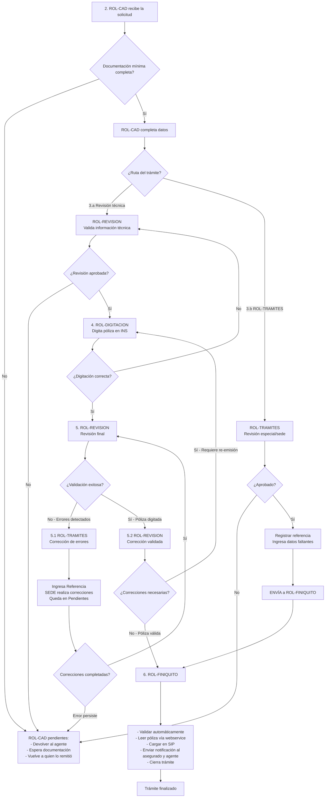

# Emisión de Riesgos de Trabajo

## 1. Resumen

El trámite de **Emisión de Riesgos de Trabajo** permite la emisión por ROL-DIGITACION.

El trámite ingresa como una **solicitud** al ROL-CAD **CAD - Centro de Atención Digital**. CAD valida la documentación recibida, extrae datos relevantes y crea el trámite en el sistema.

## 2. ROL-CAD primer paso
El sistema muestra los documentos faltantes en caso de que no se hayan adjuntados los documentos requeridos. CAD puede solicitar que se complete la documentación y mantener la solicitud en espera.

Si los documentos minimos requeridos están presentes se hace una revisón de los datos extraídos con el **asistente para crear tramites** y se valida la consistencia de la información.

- Verifica si la póliza existe en el INS. Completa el campo **"Cuenta con numero de poliza, si o no"**
- En caso de que la solicitud diga propietario y no lo sea:
  - ↩ **DEVUELVE** al Agente y queda en **Pendientes** mientras el Agente realiza su trabajo.

ROL-CAD debe completar los datos faltantes.

- Campos Enviar a la sede = si ➜ **ENVÍA** a ROL-TRAMITES.
  - Cuenta con numero de poliza
  - RT-Especial Formación técnica Dual (dos Corto Plazo y Permanente)
  - RT-Sector Publico

- Validacion
  - Rt-Construcción y RT-Cocechas: Deben tener RT.FormaDePago = corto plazo
  - RT-Adolescente, RT-Agricola, RT-Hogar, RT-Ocacional, RT-Sector Publico: Deben tener RT.FormaDePago ≠ corto plazo

Si no pasa las validaciones el tramite se ↩ **DEVUELVE** y queda en **Pendientes** mientras CAD realiza su trabajo.

- ➜ **ENVÍA** a ROL-REVISION.

## 3.a ROL-REVISION, segundo paso Revisión 

ROL-REVISION valida la información técnica.

- ➜ **ENVÍA** a ROL-DIGITACION para que se digite la póliza en los sistemas del INS.
- ↩ **DEVUELVE** a ROL-CAD si detecta inconsistencias, con comentarios para que el CAD haga las correcciones necesarias.
  - Los tramites devueltos a ROL-CAD quedan en **Pendientes** mientras CAD realiza su trabajo.

## 3.b Sede ROL-TRAMITES
ROL-TRAMITES actua como un revisor, puede cargar la cotización si no existe, pero no es obligatoria.

- Se debe ingresar el valor **Referencia** para hacer seguimiento del tramite.
- Los tramites en ROL-TRAMITES quedan en **Pendientes** mientras la SEDE realiza su trabajo.

- ➜ **ENVÍA** a ROL-FINIQUITO una vez emitida la póliza e ingresado el número de póliza.
- ↩ **DEVUELVE** a ROL-CAD si detecta inconsistencias, con comentarios para que el CAD haga las correcciones necesarias.
  - Los tramites devueltos a ROL-CAD quedan en **Pendientes** mientras CAD realiza su trabajo.

## 4. ROL-DIGITACION, cuarto paso Digitación 
Digita la póliza en los sistemas del INS, debe ingresar el **número de póliza**.

- ➜ **ENVÍA** a ROL-REVISION para validación final.
- ↩ **DEVUELVE** a ROL-REVISION si detecta inconsistencias, con comentarios para que el revisor haga las correcciones necesarias.

## 5 ROL-REVISION, Revisión final

ROL-REVISION valida la información digitada y la compara con la información del sistema.

- ➜ **ENVÍA** a ROL-FINIQUITO si la póliza ya fue digitada.
- ↩ **DEVUELVE** a ROL-TRAMITES si detecta inconsistencias, con comentarios para que el área de tramites y solicite a SEDE haga las correcciones necesarias.

## 5.1 ROL-TRAMITES, correccion de errores

- Se debe ingresar el valor **Referencia** para hacer seguimiento del tramite.
- Los tramites en ROL-TRAMITES quedan en **Pendientes** mientras la SEDE realiza su trabajo.

- ➜ **ENVÍA** a ROL-REVISOR una vez emitida la póliza e ingresado el número de póliza.
- ↩ **DEVUELVE** a ROL-REVISOR para consultar y el revisor puede insitir o devoelver a ROL-CAD si detecta inconsistencias, con comentarios para que el CAD haga las correcciones necesarias.

## 5.2 ROL-REVISION, corrección de errores

ROL-REVISION valida la información.

- ➜ **ENVÍA** a ROL-FINIQUITO si la póliza ya fue digitada.
en caso de error
- ↩ **DEVUELVE** a ROL-DIGITACION si es necesario vuelvan a emitir recibos.

## 6. ROL-FINIQUITO

Lee la póliza vía webservice y la carga en SIP.

- Envia notificacion al asegurado y al agente.
- Cierra el tramite.

## 7. Diagrama del flujo para usuarios (Puntos 2 al 6)

** Puntos explicados:
- **Punto 2:** CAD recibe solicitud, valida documentación mínima, completa datos
- **Punto 3.a:** ROL-REVISION valida información técnica
- **Punto 3.b:** ROL-TRAMITES actúa como revisor especial (puede cargar cotización, ingresa referencia)
- **Punto 4:** ROL-DIGITACION digita la póliza en sistemas del INS
- **Punto 5:** ROL-REVISION revisión final
- **Punto 5.1:** ROL-TRAMITES corrección de errores (cuando revisión final detecta problemas)
- **Punto 5.2:** ROL-REVISION corrección de errores (valida que correcciones sean suficientes)
- **Punto 6:** ROL-FINIQUITO carga en SIP y cierra trámite
## 8. Documentos requeridos

| Orden | Documento | Código | Obligatorio | Responsable de validación | Observaciones |
|---:|---|---|---|---|---|
| 1 | Solicitud de riesgos de trabajo - parte 1 | DOC-SOLICITUD-RT-P1 | Sí | ROL-CAD | Documento base del trámite |
| 2 | Solicitud de riesgos de trabajo - parte 2 | DOC-SOLICITUD-RT-P2 | Sí | ROL-CAD | Documento base del trámite |
| 3 | Solicitud de riesgos de trabajo - parte 3 | DOC-SOLICITUD-RT-P3 | Sí | ROL-CAD | Documento base del trámite |
| 7 | Perfeccionamiento | DOC-PERFECCIONAMIENTO | Condicional | ROL-CAD | Se utiliza para el cierre del trámite |
| 8 | Deber de información | DOC-DEBER-INFORMACION | Condicional | ROL-CAD | Se utiliza para el cierre del trámite |
| 9 | Cotización | DOC-COTIZACION-HOGAR | Condicional | ROL-REVISION | Si no viene, puede cargarla revisión |
| 10 | Registro nacional | DOC-REGISTRO-NACIONAL | Documento de registro nacional | No | Documento de consulta web |

---
## 9. Datos del trámite

Los campos se documentan usando el **nombre actual del campo**, la **sección del formulario** y el **tipo de dato** informado en el archivo de campos.

## 9.1 Datos generales de la solicitud

| Sección | Campo actual | Label | Tipo de dato | Uso |
|---|---|---|---|---|
| FECHA DE SOLICITUD | `Fecha` | Fecha y Hora | Date | Fecha de ingreso o firma de solicitud |
| TIPO DE TRAMITE | `TIPOTRAMITE` | Tipo | List | Debe corresponder a Emisión |
| TIPO DE TRAMITE | `Poliza` | Poliza | Text | Número de póliza si corresponde |

## 9.2 Datos del tomador

| Sección | Campo actual | Label | Tipo de dato | Uso |
|---|---|---|---|---|
| DATOS DEL TOMADOR | `Tomador.Nombre` | Nombre o Razón social | Text | Identificación del tomador |
| DATOS DEL TOMADOR | `Tomador.TIpoIdentificacion` | Tipo de Identificación | List | Debe tomarse de catálogo del sistema |
| DATOS DEL TOMADOR | `Tomador.Identificacion` | Identificación | Text | Número de identificación |
| DATOS DEL TOMADOR | `Tomador.Email` | Correo Electrónico | Email | Medio de contacto |
| DATOS DEL TOMADOR | `Tomador.Domicilio` | Domicilio | Text | Dirección |
| DATOS DEL TOMADOR | `Tomador.Provincia` | Provincia | Text | Ubicación |
| DATOS DEL TOMADOR | `Tomador.Canton` | Cantón | Text | Ubicación |
| DATOS DEL TOMADOR | `Tomador.Distrito` | Distrito | Text | Ubicación |
| DATOS DEL TOMADOR | `Tomador.Telefono` | Teléfono | Phone | Teléfono principal |
| DATOS DEL TOMADOR | `Tomador.Telefono2` | Teléfono2 | Phone | Teléfono secundario |
| DATOS DEL TOMADOR | `Tomador.Notificacion` | Notificar | List | Tomador o asegurado |
| DATOS DEL TOMADOR | `Tomador.MedioNotificacion` | Notificar vía | List | Domicilio, teléfono, correo, apartado postal o fax |

## 9.3 Datos de la propiedad
| Sección | Campo actual | Label | Tipo de dato | Uso |
|---|---|---|---|---|
|DATOS INTERMEDIARIO | `RT.CodigoActividad` | Código de actividad | Text | Código de actividad del riesgo de trabajo |

## 9.5 Prima y observaciones
| Sección | Campo actual | Label | Tipo de dato | Uso |
|---|---|---|---|---|
| OBSERVACIONES | `Observaciones` | Observaciones | Text | Comentarios generales |

## 9.6 Datos de la poliza

| Sección | Campo actual | Label | Tipo de dato | Uso |
|---|---|---|---|---|
| DATOS DE LA POLIZA | `RT.FormaAseguramiento` | Forma de Aseguramiento | List | RT-Construcción, RT-Cocechas... |
| DATOS DE LA POLIZA | `Vigencia.Desde` | Vigencia Desde | Date | Fecha desde |
| DATOS DE LA POLIZA | `Vigencia.Hasta` | Vigencia Hasta | Date | Fecha hasta |
| DATOS DE LA POLIZA | `RT.FormaDePago` | Forma de pago | List | Corto Plazo, Anual, Semestral, Trimestral, Mensual |

## 10. Pasos operativos por rol

### 10.1 CAD

#### Entrada

- Solicitud inicial.
- Documentos adjuntos.
- Datos capturados o extraídos automáticamente.

#### Tareas

1. Cargar documentos.
2. Validar documentos requeridos.
3. Buscar en el sistema del INS si la póliza ya existe.
4. Validar consistencia de datos.
5. Crear trámite.
6. Completar datos faltantes.
7. Enviar a ROL-DIGITACION o ROL-TRAMITES

#### Salidas posibles

| Resultado | Próximo rol |
|---|---|
| Documentación incompleta | Agente |
| Documentación completa | ROL-REVISION |
| Depende del tramite | ROL-TRAMITES |

### 10.2 Revisión

#### Entrada

- Trámite creado por CAD.
- Documentos validados.
- Datos extraídos.

#### Tareas

1. Validar información técnica.
2. Informar prima deseada.
3. Completar emisión desde / hasta.
4. Enviar a digitación.

#### Salidas posibles

| Resultado | Próximo rol |
|---|---|
| Falta documentación | Agente / ROL-CAD |
| Requiere correcciones | ROL-TRAMITES |
| Aprobado para digitar | ROL-DIGITACION |

### 10.3 Digitación

#### Entrada

- Datos ordenados del sistema.
- Indicaciones del revisor.

#### Tareas

1. Tomar datos desde el sistema.
2. Cargar datos en sistemas del INS, preferentemente copiar y pegar.
3. Digitar la póliza.
4. Registrar resultado, carga numero de poliza.
5. Enviar a revisión final.

#### Salidas posibles

| Resultado | Próximo rol |
|---|---|
| Póliza digitada | ROL-REVISION |
| Error detectado | ROL-REVISION |

### 10.4 Revisión final

#### Entrada

- Póliza digitada.
- Datos del sistema.

#### Tareas

1. Validar que la digitación sea correcta.
2. Enviar a finiquito.
3. Devolver a digitación si hay errores.

#### Salidas posibles

| Resultado | Próximo rol |
|---|---|
| Digitación incorrecta | ROL-TRAMITES |
| Datos correctos | ROL-FINIQUITO |

### 10.5 Finiquito

#### Entrada

- Póliza verificada.
- Datos coincidentes.

#### Tareas

1. Enviar notificacion al asegurado y al agente.
2. Cerrar trámite.
3. Dejar trazabilidad del cierre.

## 11. Alertas del sistema

| Código | Mensaje | Condición | Rol visible |
|---|---|---|---|
## 12. Historial de cambios

| Versión | Fecha | Autor | Cambio | En Producción |
|---|---|---|---|---|
| 1.0 | 2026-08-07 | Equipo funcional | Primera versión estandarizada | No |
