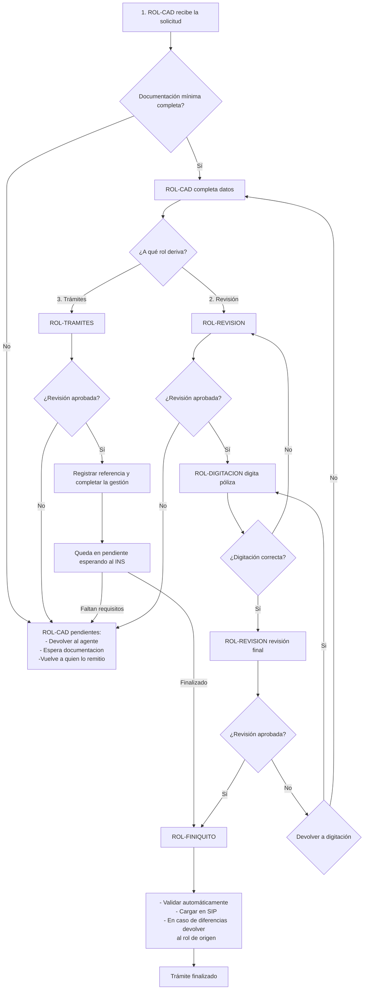

# Emisión de Hogar Seguro 2000

## 1. Resumen

El trámite de **Emisión de Hogar Seguro 2000** permite la emisión por ROL-DIGITACION.

El trámite ingresa como una **solicitud** al ROL-CAD **CAD - Centro de Atención Digital**. CAD valida la documentación recibida, extrae datos relevantes y crea el trámite en el sistema.

## 2. ROL-CAD primer paso
El sistema muestra los documentos faltantes en caso de que no se hayan adjuntados los documentos requeridos. CAD puede solicitar que se complete la documentación y mantener la solicitud en espera.

Si los documentos minimos requeridos están presentes se hace una revisón de los datos extraídos con el **asistente para crear tramites** y se valida la consistencia de la información.

- Obtiene información del registro de bienes inmuebles, descarga la web y adjunta el DOC-REGISTRO-NACIONAL.
- Verifica el numero de Folio y Propietario.
- En caso de que la solicitud diga propietario y no lo sea:
  - Si en observaciones indica que está en proceso de traspaso o que es correcto, se permite continuar. (Proceso manual del ROL-CAD)
  - ↩ **DEVUELVE** al Agente y queda en **Pendientes** mientras el Agente realiza su trabajo.

ROL-CAD debe completar los datos faltantes.

- Campo Enviar a la sede = si ➜ **ENVÍA** a ROL-TRAMITES.

- ➜ **ENVÍA** a ROL-REVISION.

## 3.a ROL-REVISION, segundo paso Revisión 

- Si no existe DOC-COTIZACION-HOGAR, el revisor debe cotizar y subir el documento. El tramite se ➜ **ENVÍA** al sistema para ser procesado y derivado nuevamente a ROL-REVISION cuando esté listo.

ROL-REVISION valida la información técnica.

- Verifica o ingresa la prima total. **a mejorar** definir que prima se debe ingresar y cual se obtiene del INS.

- ➜ **ENVÍA** a ROL-DIGITACION para que se digite la póliza en los sistemas del INS.
- ↩ **DEVUELVE** a ROL-CAD si detecta inconsistencias, con comentarios para que el CAD haga las correcciones necesarias.
  - Los tramites devueltos a ROL-CAD quedan en **Pendientes** mientras CAD realiza su trabajo.

## 3.b Sede ROL-TRAMITES
ROL-TRAMITES actua como un revisor, puede cargar la cotización si no existe, pero no es obligatoria.

- Se debe ingresar el valor **Referencia** para hacer seguimiento del tramite.
- Los tramites en ROL-TRAMITES quedan en **Pendientes** mientras la SEDE realiza su trabajo.

- ➜ **ENVÍA** a ROL-FINIQUITO una vez emitida la póliza e ingresado el número de póliza.
- ↩ **DEVUELVE** a ROL-CAD si detecta inconsistencias, con comentarios para que el CAD haga las correcciones necesarias.
  - Los tramites devueltos a ROL-CAD quedan en **Pendientes** mientras CAD realiza su trabajo.

## 4. ROL-DIGITACION, cuarto paso Digitación 
Digita la póliza en los sistemas del INS, debe ingresar el **número de póliza**.

- ➜ **ENVÍA** a ROL-REVISION para validación final.
- ↩ **DEVUELVE** a ROL-REVISION si detecta inconsistencias, con comentarios para que el revisor haga las correcciones necesarias.

## 5 ROL-REVISION, Revisión final

ROL-REVISION valida la información digitada y la compara con la información del sistema.

- ➜ **ENVÍA** a ROL-FINIQUITO si la póliza ya fue digitada.
- ↩ **DEVUELVE** a ROL-DIGITACION si detecta inconsistencias, con comentarios para que el digitador haga las correcciones necesarias.
  - Los tramites devueltos a ROL-DIGITACION quedan en **Pendientes** mientras el digitador realiza su trabajo.
- ↩ **DEVUELVE** a ROL-CAD si detecta inconsistencias, con comentarios para que el revisor haga las correcciones necesarias.
  - Los tramites devueltos a ROL-CAD quedan en **Pendientes** mientras CAD realiza su trabajo.

## 6. ROL-FINIQUITO

Lee la póliza vía webservice y la carga en SIP.

**provisorio**: Validar numero de Folio y Prima total.

↩ **DEVUELVE** a ROL-REVISION si detecta inconsistencias, con comentarios para que el revisor haga las correcciones necesarias.

- Envia notificacion al asegurado y al agente.
- Cierra el tramite.

## 6. Diagrama del flujo 1 a 5 para usuarios

** explicar cuando el tramite queda en pendientes de ROL-TRAMITE.
## 7. Documentos requeridos

| Orden | Documento | Código | Obligatorio | Responsable de validación | Observaciones |
|---:|---|---|---|---|---|
| 1 | Solicitud de hogar seguro 2000 - parte 1 | DOC-SOLICITUD-HOGARSEG-P1 | Sí | ROL-CAD | Documento base del trámite |
| 2 | Solicitud de hogar seguro 2000 - parte 2 | DOC-SOLICITUD-HOGARSEG-P2 | Sí | ROL-CAD | Documento base del trámite |
| 3 | Solicitud de hogar seguro 2000 - parte 3 | DOC-SOLICITUD-HOGARSEG-P3 | Sí | ROL-CAD | Documento base del trámite |
| 4 | Solicitud de hogar seguro 2000 - parte 4 | DOC-SOLICITUD-HOGARSEG-P4 | Sí | ROL-CAD | Documento base del trámite |
| 5 | Perfeccionamiento | DOC-PERFECCIONAMIENTO | Condicional | ROL-CAD | Se utiliza para el cierre del trámite |
| 6 | Deber de información | DOC-DEBER-INFORMACION | Condicional | ROL-CAD | Se utiliza para el cierre del trámite |
| 7 | Cotización | DOC-COTIZACION-HOGAR | Condicional | ROL-REVISION | Si no viene, puede cargarla revisión |
| 8 | Registro nacional | DOC-REGISTRO-NACIONAL | Documento de registro nacional | No | Documento de consulta web |

---
## 8. Datos del trámite

Los campos se documentan usando el **nombre actual del campo**, la **sección del formulario** y el **tipo de dato** informado en el archivo de campos.

## 8.1 Datos generales de la solicitud

| Sección | Campo actual | Label | Tipo de dato | Uso |
|---|---|---|---|---|
| FECHA DE SOLICITUD | `Fecha` | Fecha y Hora | Date | Fecha de ingreso o firma de solicitud |
| TIPO DE TRAMITE | `TIPOTRAMITE` | Tipo | List | Debe corresponder a Emisión |
| TIPO DE TRAMITE | `Poliza` | Poliza | Text | Número de póliza si corresponde |

## 8.2 Datos del asegurado

| Sección | Campo actual | Label | Tipo de dato | Uso |
|---|---|---|---|---|
| DATOS DEL ASEGURADO | `Asegurado.Nombre` | Nombre o Razón social | Text | Identificación del asegurado |
| DATOS DEL ASEGURADO | `Asegurado.TIpoIdentificacion` | Tipo de Identificación | List | Debe tomarse de catálogo del sistema |
| DATOS DEL ASEGURADO | `Asegurado.Identificacion` | Identificación | Text | Número de identificación |
| DATOS DEL ASEGURADO | `Asegurado.Email` | Correo Electrónico | Email | Medio de contacto |
| DATOS DEL ASEGURADO | `Asegurado.Domicilio` | Domicilio | Text | Dirección |
| DATOS DEL ASEGURADO | `Asegurado.Provincia` | Provincia | Text | Ubicación |
| DATOS DEL ASEGURADO | `Asegurado.Canton` | Cantón | Text | Ubicación |
| DATOS DEL ASEGURADO | `Asegurado.Distrito` | Distrito | Text | Ubicación |
| DATOS DEL ASEGURADO | `Asegurado.Telefono` | Teléfono | Phone | Teléfono principal |
| DATOS DEL ASEGURADO | `Asegurado.Telefono2` | Teléfono2 | Phone | Teléfono secundario |
| DATOS DEL ASEGURADO | `Asegurado.Notificacion` | Notificar | List | Tomador o asegurado |
| DATOS DEL ASEGURADO | `Asegurado.MedioNotificacion` | Notificar vía | List | Domicilio, teléfono, correo, apartado postal o fax |

## 8.3 Datos de la propiedad
| Sección | Campo actual | Label | Tipo de dato | Uso |
|---|---|---|---|---|
|DATOS DE LA PROPIEDAD | `Propiedad.Finca` | Nro de Folio o finca | Text | Numero de folio real o finca |
|INTERES ASEGURABLE | `InteresAsegurable` | Interés Asegurable | List | Lista de intereses asegurables |

## 8.4 Datos del Acreedor

| Sección | Campo actual | Label | Tipo de dato | Uso |
|---|---|---|---|---|
| DATOS DEL ACREEDOR | `Acreedor.Nombre` | Acreedor | Text | Aplica si existe acreedor |
| DATOS DEL ACREEDOR | `Acreedor.Identificacion` | Id Acreedor | Text | Identificación del acreedor |
| DATOS DEL ACREEDOR | `Acreedor.TipoIdentificacion` | Tipo de Identificación Acreedor | List | Catálogo del sistema |
| DATOS DEL ACREEDOR | `Acreedor.Monto` | Acreedor Monto | Number | Monto acreedor |
| DATOS DEL ACREEDOR | `Acreedor.Grado` | Grado Acreencia | Number | Grado de acreencia |

## 8.5 Prima y observaciones
| Sección | Campo actual | Label | Tipo de dato | Uso |
|---|---|---|---|---|
| PRIMA DEL SEGURO | `Prima` | Prima Total | Number | Prima total |
| OBSERVACIONES | `Observaciones` | Observaciones | Text | Comentarios generales |

## 8.6 Datos de la poliza

| Sección | Campo actual | Label | Tipo de dato | Uso |
|---|---|---|---|---|
| DATOS DE LA POLIZA | `FormaAseguramiento` | Forma de Aseguramiento | List | Valor Declarado, Primer riesgo absoluto o Valor convenido |
| DATOS DE LA POLIZA | `Vigencia.Desde` | Vigencia Desde | Date | Fecha desde |
| DATOS DE LA POLIZA | `Vigencia.Hasta` | Vigencia Hasta | Date | Fecha hasta |
| DATOS DE LA POLIZA | `Vigencia.Periodo` | Vigencia | List | Anual o Corto Plazo |
| DATOS DE LA POLIZA | `FormaDePago` | Forma de pago | List | Debe tomarse del sistema |
| DATOS DE LA POLIZA | `ConductoDeCobro` | Via de pago | List | Cargo Automático o Deducción Mensual |

## 9. Pasos operativos por rol

### 9.1 CAD

#### Entrada

- Solicitud inicial.
- Documentos adjuntos.
- Datos capturados o extraídos automáticamente.

#### Tareas

1. Cargar documentos.
2. Validar documentos requeridos.
3. Buscar en el registro y cargar el documento.
4. Validar consistencia de datos.
5. Crear trámite.
6. Completar datos faltantes.
7. Enviar a ROL-TRAMITES

#### Salidas posibles

| Resultado | Próximo rol |
|---|---|
| Documentación incompleta | Agente |
| Documentación completa | ROL-REVISION |
| Requiere tratamiento especial | ROL-TRAMITES |

### 9.2 Revisión

#### Entrada

- Trámite creado por CAD.
- Documentos validados.
- Datos extraídos.

#### Tareas

1. Completar cotización si no fue adjuntada.
2. Validar información técnica.
3. Informar prima deseada.
4. Completar emisión desde / hasta.
5. Enviar a digitación.

#### Salidas posibles

| Resultado | Próximo rol |
|---|---|
| Falta documentación | Agente / ROL-CAD |
| Requiere sede o trámite especial | ROL-TRAMITES |
| Aprobado para digitar | ROL-DIGITACION |

### 9.3 Digitación

#### Entrada

- Datos ordenados del sistema.
- Indicaciones del revisor.

#### Tareas

1. Tomar datos desde el sistema.
2. Cargar datos en sistemas del INS, preferentemente copiar y pegar.
3. Digitar la póliza.
4. Registrar resultado, carga numero de poliza.
5. Enviar a revisión final.

#### Salidas posibles

| Resultado | Próximo rol |
|---|---|
| Póliza digitada | ROL-REVISION |
| Error detectado | ROL-REVISION |

### 9.4 Revisión final

#### Entrada

- Póliza digitada.
- Datos del sistema.

#### Tareas

1. Validar que la digitación sea correcta.
2. Enviar a finiquito.
3. Devolver a digitación si hay errores.

#### Salidas posibles

| Resultado | Próximo rol |
|---|---|
| Digitación incorrecta | ROL-DIGITACION |
| Datos correctos | ROL-FINIQUITO |

### 9.5 Finiquito

#### Entrada

- Póliza verificada.
- Datos coincidentes.

#### Tareas

1. Enviar notificacion al asegurado y al agente.
2. Cerrar trámite.
3. Dejar trazabilidad del cierre.

## 10. Alertas del sistema

| Código | Mensaje | Condición | Rol visible |
|---|---|---|---|
## 11. Historial de cambios

| Versión | Fecha | Autor | Cambio | En Producción |
|---|---|---|---|---|
| 1.0 | 2026-07-14 | Equipo funcional | Primera versión estandarizada | Si |
| 1.1 | 2026-07-17 | Equipo funcional | Copia del flujo definido en Hogar Comprensivo | Si |
| 1.2 | 2026-07-20 | Equipo funcional | Flujo en caso de error en finiquito | Si |
| 1.3 | 2026-08-07 | Equipo funcional | Actualización de versión, fecha y estado de producción en historial | Si |