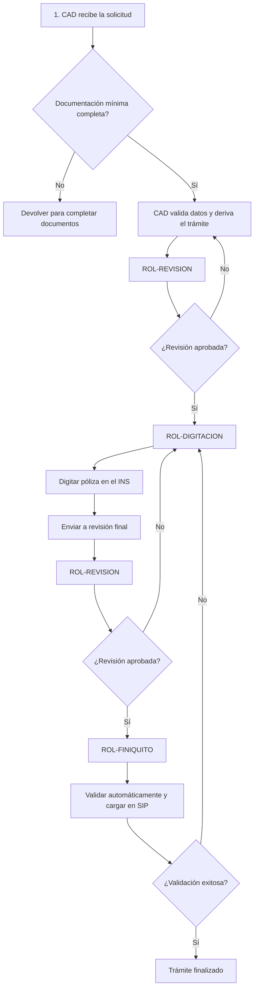

# Tramite generico en Digitación

## 1. Resumen

El trámite de **Trámite genérico en Digitación** permite gestionar una solicitud genérica por digitación.

El trámite ingresa al **ROL-CAD**. Cad valida la documentación, extrae los datos relevantes y crea el trámite en el sistema. Después de Cad, el único flujo posible es ROL-REVISION.

## 2. ROL-CAD, primer paso

El sistema muestra los documentos. CAD puede solicitar que se complete la documentación y mantener la solicitud en espera.

El requisito documental es a criterio del usuario.

- La solicitud genérica, se utiliza en reemplazo de cualquier documento requerido para el trámite. El sistema necesita al menos un documentos que sustente los datos.

Cuando la documentación mínima está presente, CAD revisa los datos extraídos con el **asistente para crear trámites** y valida la consistencia de la información.

## 3.a Revisión ROL-REVISION
ROL-REVISION valida la información técnica.

- ➜ **ENVÍA** a ROL-DIGITACION para que se digite la póliza en los sistemas del INS o para realizar correcciones.
- ➜ **ENVÍA** a ROL-FINIQUITO si la póliza ya fue digitada.
- ↩ **DEVUELVE** a ROL-CAD si detecta inconsistencias, con comentarios para que el Agente haga las correcciones necesarias.
  - Los tramites devueltos a ROL-CAD quedan en **Pendientes** mientras CAD realiza su trabajo.

## 4. Digitación ROL-DIGITACION
Digita la póliza en los sistemas del INS, puede ingrear el **número de poliza**.

- ➜ **ENVÍA** a ROL-REVISION para validación final.
- ↩ **DEVUELVE** a ROL-REVISION si detecta inconsistencias, con comentarios para que el revisor haga las correcciones necesarias.

## 5. ROL-FINIQUITO

Lee la póliza vía webservice y la carga o actualiza en SIP.

## 6. Diagrama del flujo para usuarios

## 7. Documentos requeridos

| Orden | Opción | Documento | Código | Obligatorio | Responsable de validación | Observaciones |
|---:|---|---|---|---|---|---|
| 1 | A | Solicitud generica | DOC-SOLICITUD-GENERICA | no | ROL-CAD | Documento mínimo requerido |

## 7. Datos del trámite

Los campos se documentan usando el **nombre actual del campo**, la **sección del formulario** y el **tipo de dato** informado en el archivo de campos.

### 7.1 Datos generales

| Sección | Campo actual | Label | Tipo de dato | Uso |
|---|---|---|---|---|
| FECHA DE SOLICITUD | `Fecha` | Fecha y Hora | Date | Fecha de ingreso o firma de la solicitud |
| TIPO DE TRAMITE | `TIPOTRAMITE` | Tipo | List | Debe corresponder a Rehabilitación |
| TIPO DE TRAMITE | `Poliza` | Póliza | Text | Número de la póliza que se rehabilitará |

### 7.2 Datos del tomador

| Sección | Campo actual | Label | Tipo de dato | Uso |
|---|---|---|---|---|
| DATOS DEL TOMADOR | `Tomador.Nombre` | Nombre o Razón social | Text | Identificación del tomador |
| DATOS DEL TOMADOR | `Tomador.TIpoIdentificacion` | Tipo de Identificación | List | Debe tomarse del catálogo del sistema |
| DATOS DEL TOMADOR | `Tomador.Identificacion` | Identificación | Text | Número de identificación |
| DATOS DEL TOMADOR | `Tomador.Email` | Correo Electrónico | Email | Medio de contacto |
| DATOS DEL TOMADOR | `Tomador.Domicilio` | Domicilio | Text | Dirección |
| DATOS DEL TOMADOR | `Tomador.Provincia` | Provincia | Text | Ubicación |
| DATOS DEL TOMADOR | `Tomador.Canton` | Cantón | Text | Ubicación |
| DATOS DEL TOMADOR | `Tomador.Distrito` | Distrito | Text | Ubicación |
| DATOS DEL TOMADOR | `Tomador.Telefono` | Teléfono | Phone | Teléfono principal |
| DATOS DEL TOMADOR | `Tomador.Telefono2` | Teléfono 2 | Phone | Teléfono secundario |
| DATOS DEL TOMADOR | `Tomador.Notificacion` | Notificar | List | Tomador o asegurado |
| DATOS DEL TOMADOR | `Tomador.MedioNotificacion` | Notificar vía | List | Domicilio, teléfono, correo, apartado postal o fax |

## 7.3 Datos del asegurado

| Sección | Campo actual | Label | Tipo de dato | Uso |
|---|---|---|---|---|
| DATOS DEL ASEGURADO | `Asegurado.Nombre` | Nombre o Razón social | Text | Identificación del asegurado |
| DATOS DEL ASEGURADO | `Asegurado.TIpoIdentificacion` | Tipo de Identificación | List | Debe tomarse de catálogo del sistema |
| DATOS DEL ASEGURADO | `Asegurado.Identificacion` | Identificación | Text | Número de identificación |
| DATOS DEL ASEGURADO | `Asegurado.Email` | Correo Electrónico | Email | Medio de contacto |
| DATOS DEL ASEGURADO | `Asegurado.Domicilio` | Domicilio | Text | Dirección |
| DATOS DEL ASEGURADO | `Asegurado.Provincia` | Provincia | Text | Ubicación |
| DATOS DEL ASEGURADO | `Asegurado.Canton` | Cantón | Text | Ubicación |
| DATOS DEL ASEGURADO | `Asegurado.Distrito` | Distrito | Text | Ubicación |
| DATOS DEL ASEGURADO | `Asegurado.Telefono` | Teléfono | Phone | Teléfono principal |
| DATOS DEL ASEGURADO | `Asegurado.Telefono2` | Teléfono2 | Phone | Teléfono secundario |
| DATOS DEL ASEGURADO | `Asegurado.Notificacion` | Notificar | List | Tomador o asegurado |
| DATOS DEL ASEGURADO | `Asegurado.MedioNotificacion` | Notificar vía | List | Domicilio, teléfono, correo, apartado postal o fax |

### 7.4 Datos de riesgos de trabajo

| Sección | Campo actual | Label | Tipo de dato | Uso |
|---|---|---|---|---|
| DATOS DE LA POLIZA | `Vigencia.Desde` | Vigencia Desde | Date | Fecha inicial de vigencia |
| DATOS DE LA POLIZA | `Vigencia.Hasta` | Vigencia Hasta | Date | Fecha final de vigencia |
| DATOS DE LA POLIZA | `FormaDePago` | Forma de pago | List | Corto Plazo, Anual, Semestral, Trimestral o Mensual |
| ELECCION DE OPCIONES | `FormaDePago` | Forma de pago | List | Debe tomarse del sistema |
| ELECCION DE OPCIONES | `ConductoDeCobro` | Conducto de cobro | List | Cargo Automático o Deducción Mensual |
| OBSERVACIONES | `Observaciones` | Observaciones | Text | Comentarios generales |

## 8. Pasos operativos por rol

### 8.1 CAD

#### Entrada

- Solicitud inicial.
- Documentos adjuntos.
- Datos capturados o extraídos automáticamente.

#### Tareas

1. Cargar documentos.
2. Validar documentos requeridos.
3. Buscar en el registro y cargar el documento.
4. Validar consistencia de datos.
5. Crear trámite.
6. Completar datos faltantes.
7. Enviar a ROL-TRAMITES

#### Salidas posibles

| Resultado | Próximo rol |
|---|---|
| Documentación incompleta | Agente |
| Documentación completa | ROL-REVISION |
| Requiere tratamiento especial | ROL-TRAMITES |

### 8.2 Revisión

#### Entrada

- Trámite creado por CAD.
- Documentos validados.
- Datos extraídos.

#### Tareas

1. Completar cotización si no fue adjuntada.
2. Validar información técnica.
3. Informar prima deseada.
4. Completar emisión desde / hasta.
5. Enviar a digitación.

#### Salidas posibles

| Resultado | Próximo rol |
|---|---|
| Falta documentación | Agente / ROL-CAD |
| Requiere sede o trámite especial | ROL-TRAMITES |
| Aprobado para digitar | ROL-DIGITACION |

### 8.3 Digitación

#### Entrada

- Datos ordenados del sistema.
- Indicaciones del revisor.

#### Tareas

1. Tomar datos desde el sistema.
2. Cargar datos en sistemas del INS, preferentemente copiar y pegar.
3. Digitar la póliza.
4. Registrar resultado, carga numero de poliza.
5. Enviar a revisión final.

#### Salidas posibles

| Resultado | Próximo rol |
|---|---|
| Póliza digitada | ROL-REVISION |
| Error detectado | ROL-REVISION |

### 9.4 Revisión final

#### Entrada

- Póliza digitada.
- Datos del sistema.

#### Tareas

1. Validar que la digitación sea correcta.
2. Enviar a finiquito.
3. Devolver a digitación si hay errores.

#### Salidas posibles

| Resultado | Próximo rol |
|---|---|
| Digitación incorrecta | ROL-DIGITACION |
| Datos correctos | ROL-FINIQUITO |

### 9.5 Finiquito

#### Entrada

- Póliza verificada.

#### Tareas

1. Enviar notificacion al asegurado y al agente.
2. Cerrar trámite.
3. Dejar trazabilidad del cierre.
## 10. Historial de cambios

| Versión | Fecha | Autor | Cambio | En Producción |
|---|---|---|---|---|
| 1.0 | 2026-09-21 | Equipo funcional | Primera versión del documento | No |