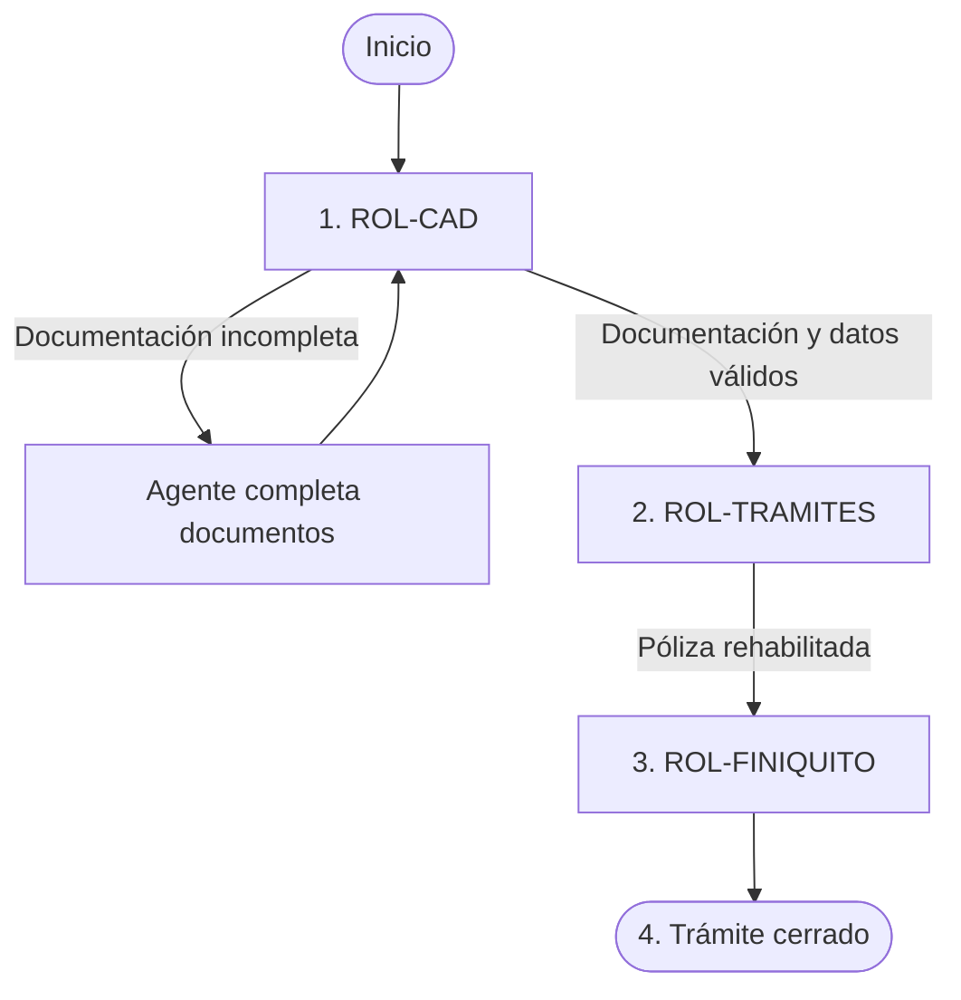

# Tramite generico en Sede

## 1. Resumen

El trámite de **Trámite genérico en Sede** permite gestionar una solicitud genérica en la sede.

El trámite ingresa al ROL-CAD **CAD - Centro de Atención Digital**. CAD valida la documentación, extrae los datos relevantes y crea el trámite en el sistema. Después de CAD, el único flujo posible es ROL-TRAMITES, seguido de ROL-FINIQUITO y el cierre del trámite.

## 2. ROL-CAD, primer paso

El sistema muestra los documentos faltantes. CAD puede solicitar que se complete la documentación y mantener la solicitud en espera.

El requisito documental es a criterio del usuario.

- La solicitud genérica, se utiliza en reemplazo de cualquier documento requerido para el trámite.

Cuando la documentación mínima está presente, CAD revisa los datos extraídos con el **asistente para crear trámites** y valida la consistencia de la información.

## 3. ROL-TRAMITES, segundo paso

ROL-TRAMITES realiza el trámite.

- Debe ingresar el valor **Referencia** para dar seguimiento al trámite.
- Debe ingresar o confirmar el **número de póliza**.
- El trámite permanece en **Pendientes** mientras se completa la gestión.
- Una vez finalizado, **ENVÍA** únicamente a ROL-FINIQUITO.

## 4. ROL-FINIQUITO, tercer paso

ROL-FINIQUITO lee la póliza mediante el servicio web.

- Si la póliza no existe en SIP la agrega, sino solicita actualizacion
- Envía la notificación al asegurado y al agente.
- Cierra el trámite.

## 5. Diagrama del flujo para usuarios

## 6. Documentos requeridos

| Orden | Opción | Documento | Código | Obligatorio | Responsable de validación | Observaciones |
|---:|---|---|---|---|---|---|
| 1 | A | Solicitud generica | DOC-SOLICITUD-GENERICA | no | ROL-CAD | Documento mínimo requerido |

## 7. Datos del trámite

Los campos se documentan usando el **nombre actual del campo**, la **sección del formulario** y el **tipo de dato** informado en el archivo de campos.

### 7.1 Datos generales

| Sección | Campo actual | Label | Tipo de dato | Uso |
|---|---|---|---|---|
| FECHA DE SOLICITUD | `Fecha` | Fecha y Hora | Date | Fecha de ingreso o firma de la solicitud |
| TIPO DE TRAMITE | `TIPOTRAMITE` | Tipo | List | Debe corresponder a Rehabilitación |
| TIPO DE TRAMITE | `Poliza` | Póliza | Text | Número de la póliza que se rehabilitará |

### 7.2 Datos del tomador

| Sección | Campo actual | Label | Tipo de dato | Uso |
|---|---|---|---|---|
| DATOS DEL TOMADOR | `Tomador.Nombre` | Nombre o Razón social | Text | Identificación del tomador |
| DATOS DEL TOMADOR | `Tomador.TIpoIdentificacion` | Tipo de Identificación | List | Debe tomarse del catálogo del sistema |
| DATOS DEL TOMADOR | `Tomador.Identificacion` | Identificación | Text | Número de identificación |
| DATOS DEL TOMADOR | `Tomador.Email` | Correo Electrónico | Email | Medio de contacto |
| DATOS DEL TOMADOR | `Tomador.Domicilio` | Domicilio | Text | Dirección |
| DATOS DEL TOMADOR | `Tomador.Provincia` | Provincia | Text | Ubicación |
| DATOS DEL TOMADOR | `Tomador.Canton` | Cantón | Text | Ubicación |
| DATOS DEL TOMADOR | `Tomador.Distrito` | Distrito | Text | Ubicación |
| DATOS DEL TOMADOR | `Tomador.Telefono` | Teléfono | Phone | Teléfono principal |
| DATOS DEL TOMADOR | `Tomador.Telefono2` | Teléfono 2 | Phone | Teléfono secundario |
| DATOS DEL TOMADOR | `Tomador.Notificacion` | Notificar | List | Tomador o asegurado |
| DATOS DEL TOMADOR | `Tomador.MedioNotificacion` | Notificar vía | List | Domicilio, teléfono, correo, apartado postal o fax |

## 7.3 Datos del asegurado

| Sección | Campo actual | Label | Tipo de dato | Uso |
|---|---|---|---|---|
| DATOS DEL ASEGURADO | `Asegurado.Nombre` | Nombre o Razón social | Text | Identificación del asegurado |
| DATOS DEL ASEGURADO | `Asegurado.TIpoIdentificacion` | Tipo de Identificación | List | Debe tomarse de catálogo del sistema |
| DATOS DEL ASEGURADO | `Asegurado.Identificacion` | Identificación | Text | Número de identificación |
| DATOS DEL ASEGURADO | `Asegurado.Email` | Correo Electrónico | Email | Medio de contacto |
| DATOS DEL ASEGURADO | `Asegurado.Domicilio` | Domicilio | Text | Dirección |
| DATOS DEL ASEGURADO | `Asegurado.Provincia` | Provincia | Text | Ubicación |
| DATOS DEL ASEGURADO | `Asegurado.Canton` | Cantón | Text | Ubicación |
| DATOS DEL ASEGURADO | `Asegurado.Distrito` | Distrito | Text | Ubicación |
| DATOS DEL ASEGURADO | `Asegurado.Telefono` | Teléfono | Phone | Teléfono principal |
| DATOS DEL ASEGURADO | `Asegurado.Telefono2` | Teléfono2 | Phone | Teléfono secundario |
| DATOS DEL ASEGURADO | `Asegurado.Notificacion` | Notificar | List | Tomador o asegurado |
| DATOS DEL ASEGURADO | `Asegurado.MedioNotificacion` | Notificar vía | List | Domicilio, teléfono, correo, apartado postal o fax |

### 7.4 Datos de riesgos de trabajo

| Sección | Campo actual | Label | Tipo de dato | Uso |
|---|---|---|---|---|
| DATOS DE LA POLIZA | `Vigencia.Desde` | Vigencia Desde | Date | Fecha inicial de vigencia |
| DATOS DE LA POLIZA | `Vigencia.Hasta` | Vigencia Hasta | Date | Fecha final de vigencia |
| DATOS DE LA POLIZA | `FormaDePago` | Forma de pago | List | Corto Plazo, Anual, Semestral, Trimestral o Mensual |
| ELECCION DE OPCIONES | `FormaDePago` | Forma de pago | List | Debe tomarse del sistema |
| ELECCION DE OPCIONES | `ConductoDeCobro` | Conducto de cobro | List | Cargo Automático o Deducción Mensual |
| OBSERVACIONES | `Observaciones` | Observaciones | Text | Comentarios generales |

## 8 Pasos operativos por rol

### 8.1 ROL-CAD

#### Entrada

- Solicitud RT completa o documento de Rehabilitación RT.
- Documentos adjuntos.
- Datos capturados o extraídos automáticamente.

#### Tareas

1. Cargar y validar los documentos requeridos.
2. Confirmar que una de las dos opciones documentales esté completa.
3. Buscar la póliza en el sistema del INS.
4. Validar la consistencia de los datos.
5. Crear el trámite y completar los datos faltantes.
6. Enviar a ROL-TRAMITES.

#### Salidas posibles

| Resultado | Próximo rol |
|---|---|
| Documentación incompleta | Agente |
| Documentación y datos válidos | ROL-TRAMITES |

### 8.2 ROL-TRAMITES

#### Entrada

- Trámite creado por ROL-CAD.
- Documentos y datos validados.
- Póliza existente identificada.

#### Tareas

1. Registrar la referencia.
2. Gestionar la rehabilitación en los sistemas del INS.
3. Registrar o confirmar el número de póliza.
4. Enviar a ROL-FINIQUITO.

#### Salidas posibles

| Resultado | Próximo rol |
|---|---|
| Gestión pendiente | ROL-TRAMITES |
| Póliza rehabilitada | ROL-FINIQUITO |

### 8.3 ROL-FINIQUITO

#### Entrada

- Póliza rehabilitada.
- Número de póliza confirmado.

#### Tareas

1. Leer la póliza mediante el servicio web y cargarla en SIP.
2. Enviar la notificación al asegurado y al agente.
3. Cerrar el trámite y dejar trazabilidad del cierre.

#### Salidas posibles

| Resultado | Estado final |
|---|---|
| Finiquito completado | Trámite cerrado |

## 9. Alertas del sistema

| Código | Mensaje | Condición | Rol visible |
|---|---|---|---|
| DOC-RT-REQUERIDO | Debe adjuntar la solicitud RT completa o el documento de Rehabilitación RT. | Ninguna opción documental está completa | ROL-CAD |
| POLIZA-RT-REQUERIDA | Debe indicar una póliza de riesgos de trabajo existente. | No se indicó el número de póliza | ROL-CAD |

## 10. Historial de cambios

| Versión | Fecha | Autor | Cambio | En Producción |
|---|---|---|---|---|
| 1.0 | 2026-09-21 | Equipo funcional | Primera versión del documento | No |